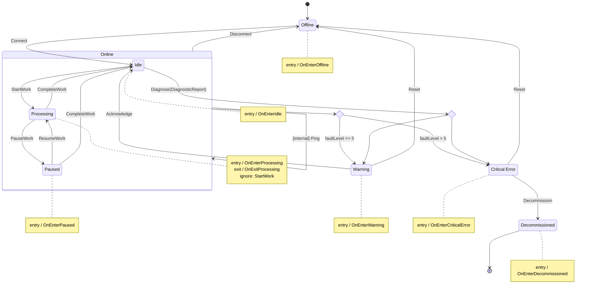

# StatelessMermaid

[](https://www.nuget.org/packages/StatelessMermaid/)
[](https://codecov.io/gh/ChaseFlorell/StatelessMermaid)
[](https://github.com/ChaseFlorell/StatelessMermaid/actions/workflows/main-build.yml)

Generates [Mermaid](https://mermaid.js.org/) state diagrams from [Stateless](https://github.com/dotnet-state-machine/stateless) state machines via a single extension method.

## Installation

```
dotnet add package StatelessMermaid
```

## Usage

Call `ToMermaid()` on any `StateMachine<TState, TTrigger>`:

```csharp
var machine = new StateMachine<State, Trigger>(State.Offline);
// ... configure machine ...

string diagram = machine.ToMermaid();
```

The output is a fenced ` ```mermaid ` code block ready to embed in a Markdown document, GitHub README, or any Mermaid-compatible renderer.

### Options

Pass a `MermaidOptions` instance to control rendering:

```csharp
string diagram = machine.ToMermaid(new MermaidOptions
{
    Title = "Device Lifecycle",
    Direction = DiagramDirection.LeftToRight,
    Version = DiagramVersion.V2,
    IncludeMarkdownBlocks = true,
});
```

| Property | Type | Default | Description |
|---|---|---|---|
| `Title` | `string?` | `null` | Adds a Mermaid front-matter title above the diagram. |
| `Direction` | `DiagramDirection` | `TopToBottom` | Layout direction: `TopToBottom`, `LeftToRight`, `RightToLeft`, `BottomToTop`. |
| `Version` | `DiagramVersion` | `V2` | `V2` (`stateDiagram-v2`, recommended) or `V1` (`stateDiagram`). Composite states, notes, and choice nodes require V2. |
| `IncludeMarkdownBlocks` | `bool` | `true` | Wraps output in a fenced ` ```mermaid ` block. Set to `false` when passing to a renderer that expects raw Mermaid syntax. |

#### Process-wide defaults

To avoid passing options on every call, configure a default once at startup:

```csharp
MermaidOptions.ConfigureDefaults(new MermaidOptions
{
    Direction = DiagramDirection.LeftToRight,
});
```

`ConfigureDefaults` returns an `IDisposable` that resets to the original defaults on dispose, which is useful in tests.

## Example

### State machine configuration

```csharp
using System.ComponentModel;
using Stateless;
using StatelessMermaid;

var machine = new StateMachine<DeviceState, DeviceTrigger>(DeviceState.Offline);

var diagnoseTrigger = machine.SetTriggerParameters<DiagnosticReport>(DeviceTrigger.Diagnose);

machine.Configure(DeviceState.Offline)
    .OnEntry(OnEnterOffline)
    .Permit(DeviceTrigger.Connect, DeviceState.Idle);

machine.Configure(DeviceState.Online)
    .OnEntry(OnEnterOnline)
    .OnExit(OnExitOnline)
    .InternalTransition(DeviceTrigger.Ping, _ => HandlePing())
    .Ignore(DeviceTrigger.Connect)
    .Permit(DeviceTrigger.Disconnect, DeviceState.Offline)
    .PermitDynamic(DeviceTrigger.Fault, () => DeviceState.Warning, "Check fault level",
        new DynamicStateInfos
        {
            { DeviceState.CriticalError, "faultLevel > 5" },
            { DeviceState.Warning,       "faultLevel <= 5" }
        });

machine.Configure(DeviceState.Idle)
    .SubstateOf(DeviceState.Online)
    .OnEntry(OnEnterIdle)
    .Permit(DeviceTrigger.StartWork, DeviceState.Processing)
    .PermitIf(diagnoseTrigger, DeviceState.Warning,       r => r.Severity < 5)
    .PermitIf(diagnoseTrigger, DeviceState.CriticalError, r => r.Severity >= 5 || r.RequiresShutdown);

machine.Configure(DeviceState.Processing)
    .SubstateOf(DeviceState.Online)
    .OnEntry(OnEnterProcessing)
    .OnExit(OnExitProcessing)
    .Ignore(DeviceTrigger.StartWork)
    .Permit(DeviceTrigger.PauseWork,    DeviceState.Paused)
    .Permit(DeviceTrigger.CompleteWork, DeviceState.Idle);

machine.Configure(DeviceState.Paused)
    .SubstateOf(DeviceState.Online)
    .OnEntry(OnEnterPaused)
    .Permit(DeviceTrigger.ResumeWork,   DeviceState.Processing)
    .Permit(DeviceTrigger.CompleteWork, DeviceState.Idle);

machine.Configure(DeviceState.Warning)
    .OnEntry(OnEnterWarning)
    .Permit(DeviceTrigger.Acknowledge, DeviceState.Idle)
    .Permit(DeviceTrigger.Reset,       DeviceState.Offline);

machine.Configure(DeviceState.CriticalError)
    .OnEntry(OnEnterCriticalError)
    .Permit(DeviceTrigger.Reset,         DeviceState.Offline)
    .Permit(DeviceTrigger.Decommission,  DeviceState.Decommissioned);

machine.Configure(DeviceState.Decommissioned)
    .OnEntry(OnEnterDecommissioned);

string diagram = machine.ToMermaid();

enum DeviceState
{
    Offline, Online, Warning,
    [Description("Critical Error")] CriticalError,
    Decommissioned, Idle, Processing, Paused
}

enum DeviceTrigger
{
    Connect, Disconnect, StartWork, PauseWork,
    ResumeWork, CompleteWork, Ping, Fault,
    Diagnose, Acknowledge, Reset, Decommission
}

record DiagnosticReport(int Severity, string Component, bool RequiresShutdown);
```

### Generated diagram

````markdown

````

Which renders as:


## Features

- **Composite states** — `SubstateOf` hierarchies render as nested Mermaid state blocks.
- **Choice nodes** — `PermitDynamic` and multiple `PermitIf` on the same trigger produce `<<choice>>` nodes.
- **Entry / exit actions** — rendered as notes attached to each state.
- **Internal transitions** — labeled with an `[internal]` prefix.
- **Ignored triggers** — listed in the state's note block.
- **Terminal states** — states with no outbound transitions to other states get a `[*]` end marker.
- **Parameterized triggers** — type names appear on the transition label (e.g. `Diagnose(DiagnosticReport)`).
- **`[Description]` labels** — states and triggers decorated with `System.ComponentModel.DescriptionAttribute` use that text as their display label; PascalCase names without a description are split into words automatically.

## License

MIT
